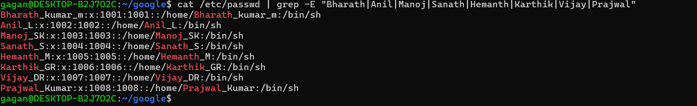

# Linux User Group Permissions

## Overview
This is a hands-on Linux project demonstrating user creation,
group management, and role-based file permissions using standard
Linux commands.

The project simulates a real-world company environment where
users are assigned to job-based groups and granted access
to specific files.

## Tools & Technologies
- Linux (Ubuntu / WSL)
- Bash Terminal
- useradd, groupadd, gpasswd
- chmod, chgrp

## Project Objectives
- Understand Linux user and group management
- Implement role-based access control (RBAC)
- Practice file permissions and ownership
- Gain real-world Linux administration experience

## Project Structure
- User creation and management
- Group creation based on roles
- File ownership and permission control

## Learning Outcomes
- Practical Linux system administration skills
- Better understanding of file permissions
- Confidence working with Linux CLI

## Future Enhancements
- Automate setup using shell scripts
- Add Access Control Lists (ACL)
- Expand to DevOps use cases

## Screenshots
- Users List: 
- Groups List: 
-File Permissions: 

## Commands Used
Detailed commands used in this project are available in [commands.md](commands.md)

